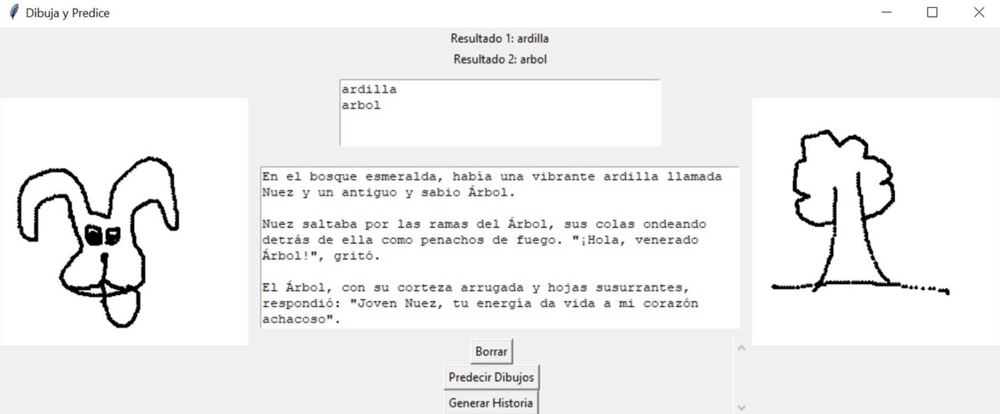
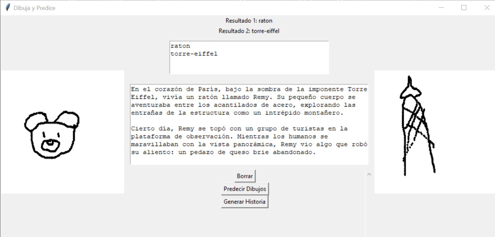

# Proyecto de Inteligencia Artificial Generativa

Este proyecto utiliza modelos preentrenados con redes convolucionales y el almacenamiento de Quick Draw de Google para clasificar imágenes de personajes y lugares. Además, genera una historia corta con Gemini AI de Google utilizando una API Key que debe ser configurada en el archivo `text_generation.py`.

## Contenido

- [Descripción](#descripción)
- [Requisitos](#requisitos)
- [Instalación](#instalación)
- [Entrenamiento](#entrenamiento)
- [Generación de Imágenes](#generación-de-imágenes)
- [Generación de Texto](#generación-de-texto)
- [Referencias](#referencias)
- [Ejemplos](#ejemplos)

## Descripción

Este proyecto emplea redes convolucionales para entrenar modelos con mapas de bits `.npy` de personajes y lugares provenientes de Quick Draw de Google. Los modelos ayudan a clasificar las imágenes y se integran con Gemini AI de Google para la generación de texto.

### Clases

#### Personajes
```python
CLASSES_PERSONAJES = {
    0: "oso",
    1: "serpiente",
    2: "leon",
    3: "raton",
    4: "cerdo",
    5: "pinguino",
    6: "conejo",
    7: "cabra",
    8: "perro",
    9: "ardilla"
}
```

#### Lugares
```python
CLASSES_LUGARES = {
    0: "arbol",
    1: "avion",
    2: "casa",
    3: "submarino",
    4: "torre-eiffel",
    5: "tren"
}
```

## Requisitos

- Python 3.12.1
- Keras
- Tkinter
- Una cuenta de Google Cloud con acceso a Gemini AI y una API Key válida

## Entrenamiento

Los modelos fueron entrenados en Google Colab. Puedes ver y ejecutar el notebook de entrenamiento [aquí](https://colab.research.google.com/drive/1sS_O2owLwWJ5sJnpnHwaJB_V9ujFK6EX?usp=sharing).

## Generación de Imágenes

Para generar imágenes, se utilizan los modelos entrenados que se guardan en un archivo `.h5`.

## Generación de Texto

Para generar texto, se utiliza la API de Gemini AI de Google. Debes modificar la API Key en el archivo `text_generation.py`.

1. Abre `text_generation.py` y edita la línea:
   ```python
   GOOGLE_API_KEY = "TU_API_KEY"
   ```

## Referencias

- [Google Quick Draw Dataset](https://quickdraw.withgoogle.com/data)
- [Google Colab Notebook de Entrenamiento](https://colab.research.google.com/drive/1sS_O2owLwWJ5sJnpnHwaJB_V9ujFK6EX?usp=sharing)
- [Gemini AI de Google](https://cloud.google.com/gemini-ai)

## Ejemplos



### Generación de Texto
